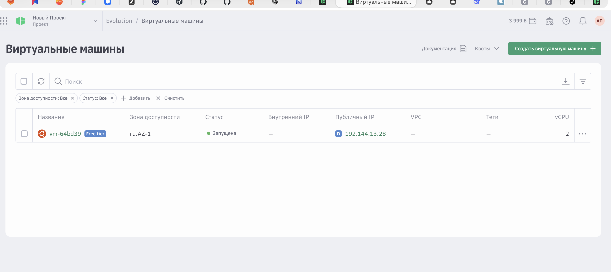
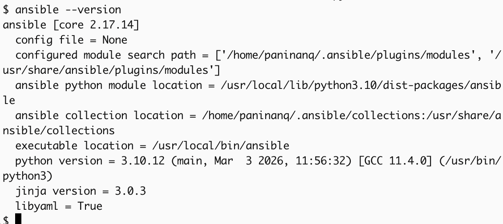
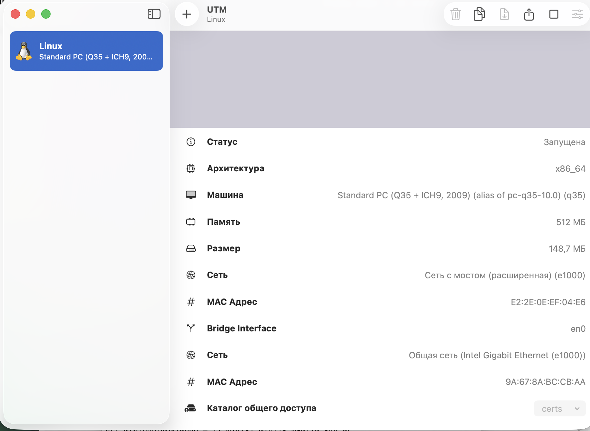
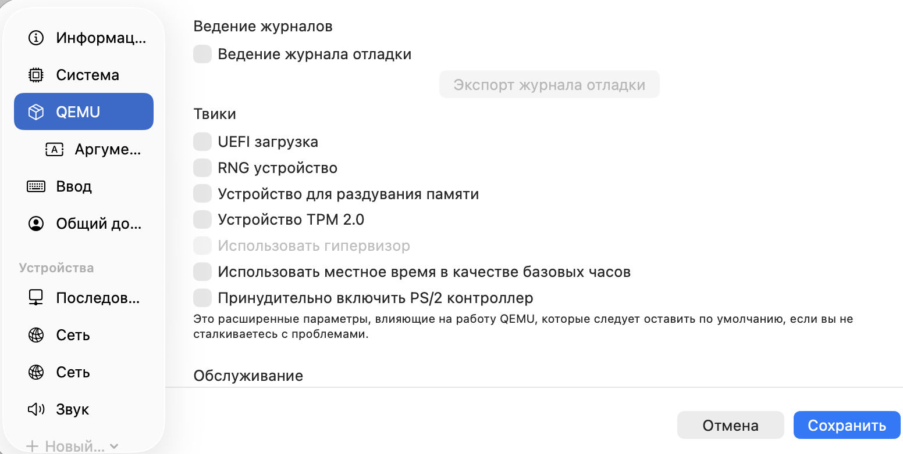
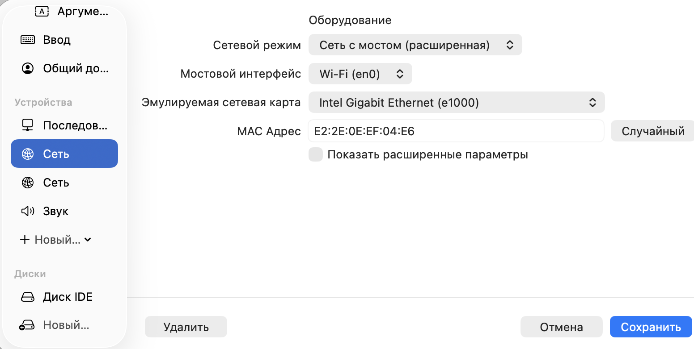
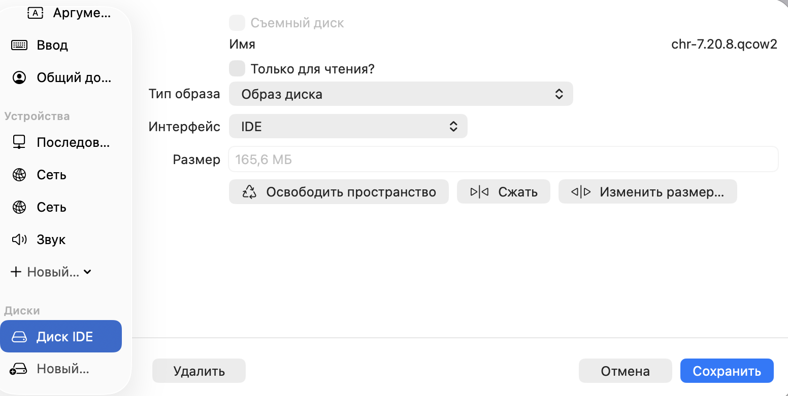
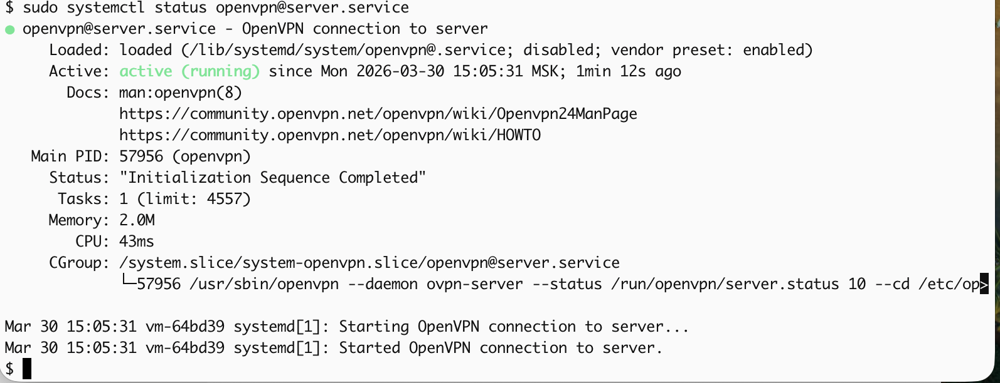
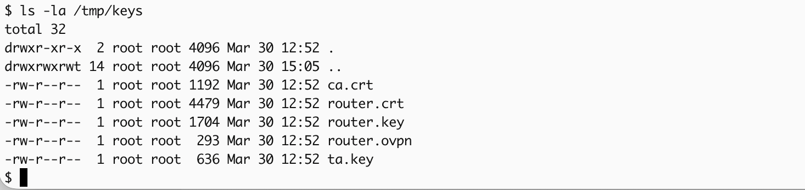
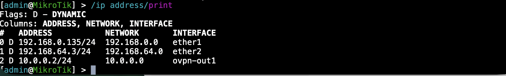
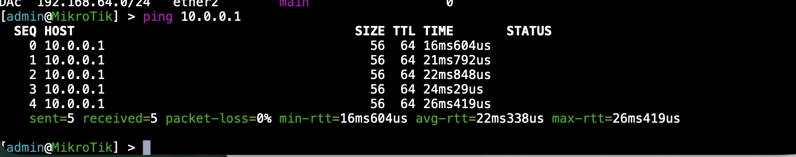

University: [ITMO University](https://itmo.ru/ru/)
Faculty: [FICT](https://fict.itmo.ru)
Course: [Network programming](https://github.com/itmo-ict-faculty/network-programming)
Year: 2025/2026
Group: K3323
Author: Panina Anna Sergeevna
Lab: Lab1
Date of create: 29.03.2026
Date of finished: 30.03.2026

# Лабораторная работа №1

## Задание

<https://itmo-ict-faculty.github.io/network-programming/education/labs2023_2024/lab1/lab1/>


### Виртуалка в облаке

Я выбрала cloud.ru, взяла бесплатную вм + публичный адрес. Там дают грант на 4000 баллов в течение 2 месяцев.



У меня версия убунту 22.04, я обновила пакеты и установила python, ansible



### Настройка MikroTik CHR

Тут на MacOs я намучилась с virtualbox, по официальной доке у меня все упорно не запускалось, как в следствие я поняла, что это из-за несоответствия архитектур: на маке в VirtualBox предлагают linux arm 64, а chr нужна архитектура x86_64))
В общем как инструмент виртуализации я выбрала UTM.
В UTM тоже свои нюансы, я реализовала следующим образом:

1. Выбираем эмуляцию

2. Отключаем UEFI и RNG

3. Отключила дисплей и добавила последовательность, сделала два интерфейса (shared network и мост, так как просто с мостом не могла подключиться к роутеру)

4. Добавила диск с образом CHR 


### VPN server

У меня уже был опыт настройки wireguard, я решила потрогать OpenVPN.

1. Установка пакетов
```
 sudo apt install easy-rsa
 sudo apt install openvpn
 sudo apt install iptables-persistent
```
Настройка  FireWall
```
 sudo iptables -I INPUT -p udp --dport 1194 -j ACCEPT
 sudo netfilter-persistent save
```
Настройка директорий VPN
```
sudo mkdir -p /etc/openvpn/keys
sudo mkdir /etc/openvpn/easy-rsa
cd /etc/openvpn/easy-rsa
sudo cp -r /usr/share/easy-rsa/* .
sudo mkdir /etc/openvpn/ccd
```
2. Настройка vars
`sudo nano vars` 

В открывшийся интерфейс вставляем:
export KEY_COUNTRY=«RU» 
export KEY_PROVINCE="Moscow"
export KEY_CITY="Moscow"
export KEY_ORG="paninanq"
export KEY_ORG="paninaanna2005@gmail.com"
export KEY_CN="paninanq"
export KEY_OU="paninanq"
export KEY_NAME="vpn.paninanq.com"
export KEY_ALTNAMES="vpn2.paninanq.com"

3. Настройка /etc/nat(FireWall)
sudo nano /etc/nat
В открывшийся интерфейс вставляем:

```
#!/bin/sh

# Включаем форвардинг пакетов
echo 1 > /proc/sys/net/ipv4/ip_forward

# Сбрасываем настройки брандмауэра
iptables -F
iptables -X
iptables -t nat -F
iptables -t nat -X

# Разрешаем инициированные нами подключения извне
iptables -A INPUT -i eth0 -m state --state ESTABLISHED,RELATED -j ACCEPT

# Разрешаем подключения по SSH
iptables -A INPUT -i eth0 -p tcp --dport 22 -j ACCEPT

# Разрешаем подключения к OpenVPN
iptables -A INPUT -i eth0 -p udp --dport 1194 -j ACCEPT

# Разрешает входящий трафик из tun0
iptables -A INPUT -i tun0 -j ACCEPT

# Разрешает транзитный трафик между eth0 и tun0:
iptables -A FORWARD -i eth0 -o tun0 -j ACCEPT
iptables -A FORWARD -i tun0 -o eth0 -j ACCEP

# Запрещаем входящие извне
iptables -A INPUT -i eth0 -j DROP

# Разрешаем инициированные нами транзитные подключения извне
iptables -A FORWARD -i eth0 -o tun0 -m state --state ESTABLISHED,RELATED -j A

# Запрещаем транзитный трафик извне
iptables -A FORWARD -i eth0 -o tun0 -j DROP

# Включаем маскарадинг для локальной сети
iptables -t nat -A POSTROUTING -o eth0 -s 10.0.0.0/24 -j MASQUERADE
```
`sudo chmod 755 /etc/nat`

4. Создание ключей сервера
```
sudo ./easyrsa init-pki
sudo ./easyrsa build-ca (вводим пароль)
sudo  ./easyrsa gen-req server nopass (вводим CN)
sudo  ./easyrsa sign-req server server
sudo  ./easyrsa gen-dh
sudo  openvpn --genkey secret pki/ta.key
sudo  cp pki/ca.crt /etc/openvpn/keys/
sudo  cp pki/issued/server.crt /etc/openvpn/keys/
sudo  cp pki/private/server.key /etc/openvpn/keys/ 
sudo  cp pki/dh.pem /etc/openvpn/keys/
sudo  cp pki/ta.key /etc/openvpn/keys/
```

5. Настройка сервера

`sudo nano /etc/openvpn/server.conf`
```
local 192.144.13.28 (ip vm)

port 1194
proto tcp
dev tun
ca keys/ca.crt
cert keys/server.crt
key keys/server.key
dh keys/dh.pem
cipher AES-256-CBC
auth SHA1
server 10.0.0.0 255.255.255.0
ifconfig-pool-persist ipp.txt
client-to-client
client-config-dir /etc/openvpn/ccd
keepalive 10 120
max-clients 32
persist-key
persist-tun
status /var/log/openvpn/openvpn-status.log
log-append /var/log/openvpn/openvpn.log
verb 4
mute 20
daemon
mode server
tls-server
tun-mtu 1500
mssfix 1620
topology subnet

push "redirect-gateway def1"
push "dhcp-option DNS 8.8.8.8"

up /etc/nat
```

6. Запуск OpenVPN
```sudo systemctl start openvpn@server```


Сервер запущен!

7. Для подключения извне добавила правило входящего правила по TCP порт 1194 для любых источников.

### RouterOS client OpenVPN

1. Генерируем серты для клиента на сервере


`cd /certs`
`sudo nano gen_sert.sh`

```
#!/bin/bash

if [ $# -ne 1 ]; then
    echo "Usage: $0 <client-name>"
    exit 1
fi

client_name=$1
password=""
rm -rf /tmp/keys
mkdir -p /tmp/keys
cd /etc/openvpn/easy-rsa || exit 1
export EASYRSA_CERT_EXPIRE=1460
echo "$password" | ./easyrsa build-client-full "$client_name" nopass

# Копируем все необходимые файлы
cp pki/issued/${client_name}.crt /tmp/keys/
cp pki/private/${client_name}.key /tmp/keys/
cp pki/ca.crt /tmp/keys/
cp pki/ta.key /tmp/keys/

chmod -R a+r /tmp/keys

# Создаем клиентский конфиг
cat << EOF > /tmp/keys/${client_name}.ovpn
client
resolv-retry infinite
nobind
remote 192.144.13.28 1194
proto udp
dev tun
comp-lzo
ca ca.crt
cert ${client_name}.crt
key ${client_name}.key
tls-client
tls-auth ta.key 1
float
keepalive 10 120
persist-key
persist-tun
tun-mtu 1500
mssfix 1620
cipher AES-256-GCM
verb 3
remote-cert-tls server
auth-nocache
EOF

echo "OpenVPN client configuration file created: /tmp/keys/${client_name}.ovpn"
echo "Client files:"
ls -la /tmp/keys/
```

`sudo bash ./gen_sert.sh router`


Забираю файлы через scp на ноут
```
scp paninanq@192.144.13.28:/tmp/keys/ca.crt .
scp paninanq@192.144.13.28:/tmp/keys/router.crt .
scp paninanq@192.144.13.28:/tmp/keys/router.key .
```
И передаю их на вм с роутером

```
scp certs/ca.crt admin@192.168.64.3:/
scp certs/router.crt admin@192.168.64.3:/
scp certs/router.key admin@192.168.64.3:/
```

2. Заходим на роутер

```
/certificate import file-name=ca.crt passphrase=""
/certificate import file-name=router.crt passphrase=""
/certificate import file-name=router.key passphrase=""
```


3. Создаем PPP профиль
```
/ppp profile add name=ovpn-client-profile local-address=10.8.0.2 remote-address=10.8.0
.1 dns-server=8.8.8.8,8.8.4.4 change-tcp-mss=yes use-encryption=required only-one=yes
```
4. Добавляем интерфейс

```
/interface ovpn-client add name="ovpn-out1" connect-to=192.144.13.28 port=1194 mode=ip
 protocol=tcp user="router" add-default-route=no disabled=no cipher=aes256-cbc certificate=router.crt_0 
 ``` 
5. Проверяем 


Отправим пинг на сервер

Работает!

## Заключение
В результате выполнения лабораторной работы была проведена установка CHR и Ansible, настройка VPN OpenVpn.

### Справочные материалы

<https://habr.com/ru/articles/744974/>
<https://github.com/tikoci/chr-utm>
<https://voxlink.ru/kb/voip-devices-configuration/ovpnclientmikrotik/>