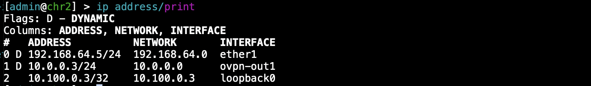
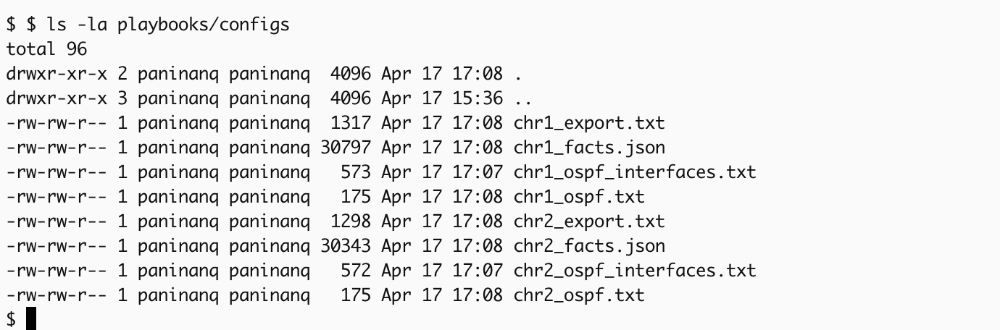

University: [ITMO University](https://itmo.ru/ru/)
Faculty: [FICT](https://fict.itmo.ru)
Course: [Network programming](https://github.com/itmo-ict-faculty/network-programming)
Year: 2025/2026
Group: K3323
Author: Panina Anna Sergeevna
Lab: Lab1
Date of create: 16.04.2026
Date of finished: 17.04.2026

# Лабораторная работа №2

## Задание

<https://itmo-ict-faculty.github.io/network-programming/education/labs2023_2024/lab2/lab2/>

### Вторая виртуалка

Вторую вм с роутером я подняла по аналогии с первой + подключила ее к впн



### Ansible 

Поместила в group vars общие переменные, в hosts_vars отличные для хостов переменные, в inventory информацию о хостах, в playbooks сам сценарий.

```
- name: Lab2 Setup - MikroTik CHR Configuration
  hosts: mikrotik
  gather_facts: no

  tasks:
    - name: Prepare local directory for configs
      delegate_to: localhost
      file:
        path: "./configs"
        state: directory
        mode: '0755'

    - name: Basic system configuration
      community.routeros.command:
        commands:
          - /system identity set name={{ inventory_hostname }}
          - /system ntp client set enabled=yes servers={{ ntp_server }}
          - /user add name={{ new_user }} password={{ new_password }} group=full

    - name: OSPF v7 routing configuration
      community.routeros.command:
        commands:
          - /interface bridge add name=loopback0
          - /ip address add address={{ loopback_ip }}/32 interface=loopback0
          - /routing ospf instance add name=instance0 version=2 router-id={{ loopback_ip }}
          - /routing ospf area add name=backbone2 area-id=0.0.0.0 instance=instance0
          - /routing ospf interface-template add interfaces=ovpn-out1,loopback0,ether1 area=backbone2 type=ptp

    - name: Save CHR facts
      community.routeros.facts:
        gather_subset: all
      register: chr_facts

    - name: Save OSPF neighbours
      community.routeros.command:
        commands:
          - /routing ospf neighbor print detail
      register: chr_ospf_neighbors

    - name: Save OSPF interfaces status
      community.routeros.command:
        commands:
          - /routing ospf interface print
      register: chr_ospf_interfaces

    - name: Save full config
      community.routeros.command:
        commands:
          - /export
      register: chr_export

    - name: Export facts to file
      delegate_to: localhost
      ansible.builtin.copy:
        content: "{{ chr_facts.ansible_facts | to_nice_json }}"
        dest: "./configs/{{ inventory_hostname }}_facts.json"

    - name: Export ospf neighbours to file
      delegate_to: localhost
      ansible.builtin.copy:
        content: "{{ chr_ospf_neighbors.stdout[0] }}"
        dest: "./configs/{{ inventory_hostname }}_ospf.txt"

    - name: Export ospf interfaces to file
      delegate_to: localhost
      ansible.builtin.copy:
        content: "{{ chr_ospf_interfaces.stdout[0] }}"
        dest: "./configs/{{ inventory_hostname }}_ospf_interfaces.txt"

    - name: Export CHR config to file
      delegate_to: localhost
      ansible.builtin.copy:
        content: "{{ chr_export.stdout[0] }}"
        dest: "./configs/{{ inventory_hostname }}_export.txt"
```
После выполнения плейбука информация собрана в файлы:



### Вывод

В ходе работы был создан второй роутер CHR, на котором по аналогии с первым были выполнены все настройки, включая OpenVpn. Затем была проведена настройка Ansible с созданием файлов хостов, переменных. После были написаны сценарии для 1 добавления нового пользователя и изменения пароля у админского аккаунта; 2 настройки NTP-клиента; 3 настройки OSPF на роутерах; 4 экспорта настроек роутеров в файлы на сервере. Цель работы достигнута.
