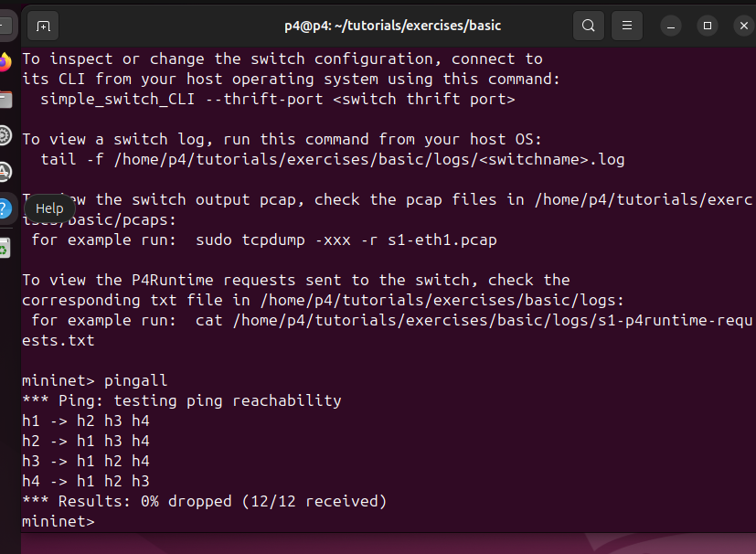
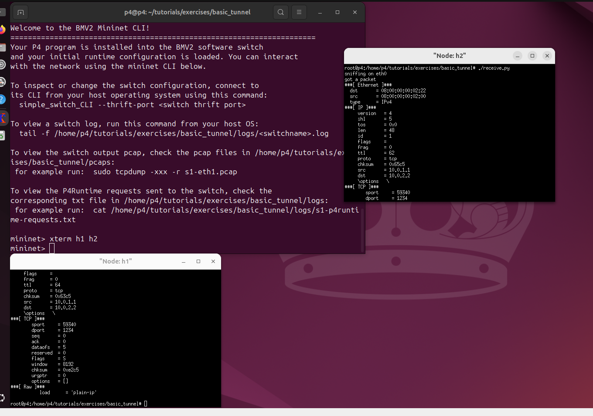
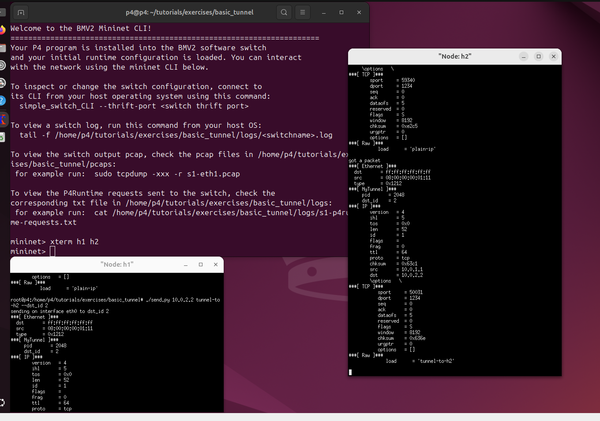
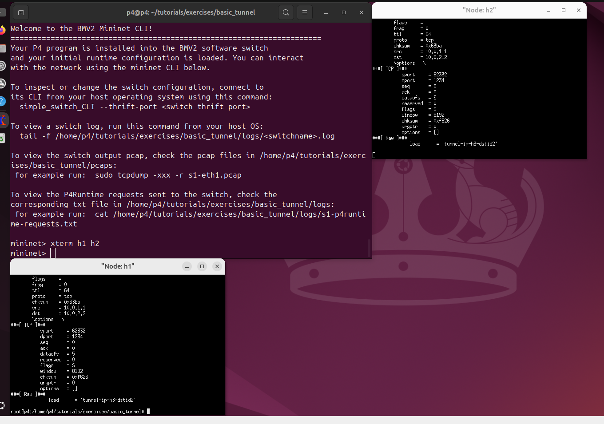

University: [ITMO University](https://itmo.ru/ru/)

Faculty: [FICT](https://fict.itmo.ru)

Course: [Network programming](https://github.com/itmo-ict-faculty/network-programming)

Year: 2025/2026

Group: K3323

Author: Panina Anna Sergeevna

Lab: Lab4

Date of create: 26.05.2026

Date of finished: 27.05.2026

# Лабораторная работа №4

## Задание

<https://itmo-ict-faculty.github.io/network-programming/education/labs2023_2024/lab4/lab4/>

### Подготовка окружения

После клонирования репозитория я запустила Vagrant:

```bash
cd tutorials/vm-ubuntu-24.04
vagrant up
```

На виртуальной машине я подготовила окружение:

```bash
cd
git clone https://github.com/p4lang/tutorials
./tutorials/vm-ubuntu-24.04/install.sh |& tee log.txt
source ~/p4setup.bash
```

### Основная переадресация

В файл `basic.p4` я добавила логику разбора Ethernet/IPv4, таблицу `ipv4_lpm`, действие `ipv4_forward` и deparser:

```p4
action ipv4_forward(macAddr_t dstAddr, egressSpec_t port) {
    standard_metadata.egress_spec = port;
    hdr.ethernet.srcAddr = hdr.ethernet.dstAddr;
    hdr.ethernet.dstAddr = dstAddr;
    hdr.ipv4.ttl = hdr.ipv4.ttl - 1;
}

table ipv4_lpm {
    key = {
        hdr.ipv4.dstAddr: lpm;
    }
    actions = {
        ipv4_forward;
        drop;
        NoAction;
    }
    size = 1024;
    default_action = drop();
}
```

Итоговый файл: [basic.p4](./basic.p4).

Проверка соединения в Mininet:



### Основное туннелирование

В `basic_tunnel.p4` была реализована поддержка собственного заголовка `myTunnel`, разбор `etherType = 0x1212`, таблица точного совпадения `myTunnel_exact` и deparser, который выпускает заголовки в последовательности `ethernet`, `myTunnel`, `ipv4`:

```p4
action myTunnel_forward(egressSpec_t port) {
    standard_metadata.egress_spec = port;
}

table myTunnel_exact {
    key = {
        hdr.myTunnel.dst_id: exact;
    }
    actions = {
        myTunnel_forward;
        drop;
    }
    size = 1024;
    default_action = drop();
}

apply {
    if (hdr.myTunnel.isValid()) {
        myTunnel_exact.apply();
    } else if (hdr.ipv4.isValid()) {
        ipv4_lpm.apply();
    }
}
```

Итоговый файл [basic_tunnel.p4](./basic_tunnel.p4).

Статические правила управления из `s1-runtime.json`, `s2-runtime.json`, `s3-runtime.json` используют таблицу `MyIngress.myTunnel_exact` и сопоставляют `dst_id` с выходным портом. Например:

```json
{
  "table": "MyIngress.myTunnel_exact",
  "match": {
    "hdr.myTunnel.dst_id": [2]
  },
  "action_name": "MyIngress.myTunnel_forward",
  "action_params": {
    "port": 2
  }
}
```

Проверка IP-маршрутизации без туннеля:



Проверка туннелирования:



Проверка того, что при наличии `myTunnel` маршрутизация выполняется по `dst_id`, а не по IP-адресу назначения:



Пакет пришел на `h2`, хотя IP-адрес `10.0.3.3` принадлежит `h3`. Это подтверждает, что для инкапсулированных пакетов коммутатор использует поле `dst_id` из заголовка `myTunnel`.

## Заключение

В ходе лабораторной работы была настроена среда для выполнения P4-упражнений. В первой части реализована базовая IPv4-коммутация: парсинг Ethernet/IPv4, LPM-таблица, изменение MAC-адресов, уменьшение TTL и передача пакета через нужный порт. Во второй части реализовано туннелирование с собственным заголовком `myTunnel` и отдельной таблицей пересылки по `dst_id`. Тесты `pingall` и передача сообщений через `send.py`/`receive.py` подтвердили локальную связность и корректную обработку туннелированных пакетов. Цель работы достигнута.